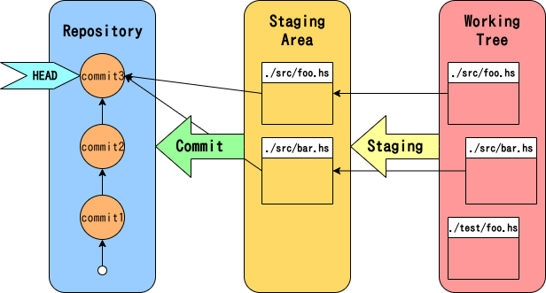

# Git基礎


## Gitとは

ファイルのバージョン管理を賢く行ってくれるツールです.

ダメな例:

```
├── 目次.txt
├── レジュメ.txt
└── test/
    ├── 作業.txt
    ├── 作業2.txt
    └── 作業_2019-11-11.txt
    ├── 作業_old.md
    ├── 作業_最新.pdf
    ├── 作業copy.md
    └── 作業ログ_2019-11-19.txt
```

Gitを使うことでファイルの変更を履歴として保存し, 簡単に復元することができます.

また, Gitはバージョン管理システムの中でも分散型とよばれる形式を採用しています.

これによって, 複数人で作業をする場合に同じファイルを編集して上書きしてしまうといった事故を防ぐことができます.


## リポジトリ

リポジトリとは, Gitが履歴を保存している場所 (e.g. `project/.git/`) のことです.

また, Gitが履歴を管理するディレクトリ (e.g. `project/`) のことをリポジトリとよぶこともあります.

通常は1つのプロジェクトなどを1つのリポジトリとしてGitで管理します.

### リモートリポジトリとローカルリポジトリ

複数人で作業する場合, 編集ファイルはサーバに置くことが多いと思います.

Gitでは, サーバにあるリポジトリをリモートリポジトリ, ローカル(手元のPCなどの端末)にあるリポジトリをローカルリポジトリとよびます.

Gitは分散型なので, リモートリポジトリを直接は編集しません.
リモートリポジトリをローカルにクローン(コピーのこと)して, ローカルリポジトリとして変更を加えていきます.


## 全体の流れ (ローカル)




## コミット

コミットはファイルの変更履歴の単位です.
1つのコミットが1つの履歴だと考えてください.

また, コミットを作成することを「コミットする」などと言います.

コミットにはどのファイルがどれだけ変更されたかの差分の情報と, コミットメッセージが含まれます.

ファイルの変更差分は何行削除され, 何行追加されたかで表現されます.
コミットメッセージはコミット時に編集します.

## ステージング (インデックス)

ステージング領域は一時的にファイルの変更差分を置いておける領域です.

コミット時, ステージング領域に置かれたすべてのファイルの変更差分がそのコミットに含まれます.

つまり, ステージング領域はどのファイルの変更差分をコミットに含めるかを選別するためのものです.


## ワーク (ワーキング) ツリー

ワーキングツリーとは, Gitが管理しているディレクトリのことです.

ファイルの変更差分は, ワーキングツリー(つまり現在編集しているファイル)からステージング領域へ置かれ, 最終的にリポジトリにコミットとして保存されます.

## ヘッド

ヘッドは現在編集している履歴を指し示します.

1つ前の履歴に戻ってファイルを編集し直す場合などでは, リポジトリは変化しませんがヘッドの位置が変化します.


## 全体の流れ (ローカル-リモート間)
