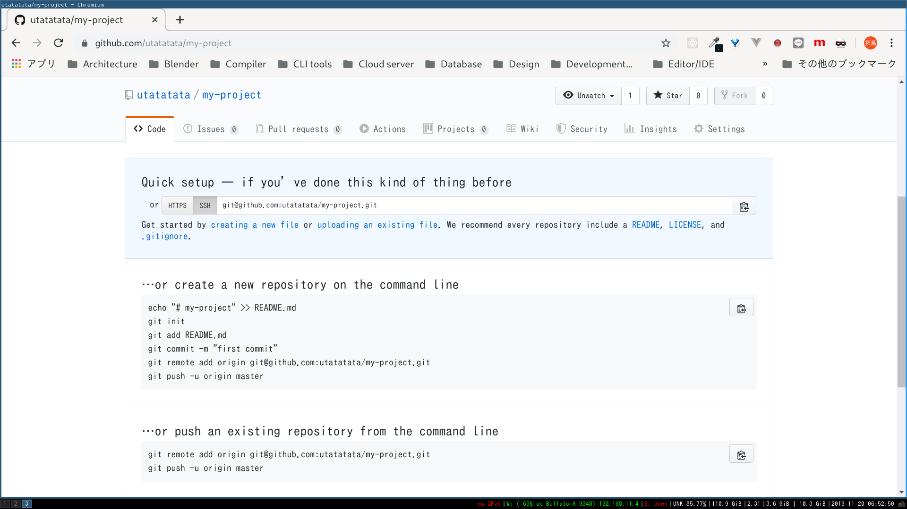

# Gitハンズオン 基礎

## ローカルで履歴管理

```
$ git init # 初回のみ
# 以下繰り返し
# 編集
$ git add -A
$ git commit

# 一区切り付いたら
$ git push -u origin master
```

### プロジェクトを作る

```
# プロジェクトのフォルダ作成
$ mkdir my-project && cd my-project

# プロジェクトのコンテンツを追加
$ mkdir src

# Bashのヒアドキュメントでファイルに出力
$ cat <<EOF > src/Main.hs
module Main where

main :: IO ()
main = do
  putStrLn "Hello, Haskell!"
EOF
```

### ローカルリポジトリを作る

```
# リポジトリの作成
$ git init

$ ls -a
./
../
.git/ # ここにリポジトリの情報が保存される
src/

# 現在のリポジトリの状態を表示
$ git status
On branch master

No commits yet

# 一度も履歴に追加されたことのないファイル (履歴を追跡していないので `Untracked`)
Untracked files:
  (use "git add <file>..." to include in what will be committed)
        src/

nothing added to commit but untracked files present (use "git add" to track)
```

### ステージングする

```
$ git add src/Main.hs

$ git status
On branch master

No commits yet

# コミットされようとしている変更
Changes to be committed:
  (use "git rm --cached <file>..." to unstage)
        new file:   src/Main.hs
```

### コミットする

```
$ git commit -m "first commit"

$ git status
On branch master
# コミットされようとしているファイルがない (ステージングエリアに無いもない)
# また, 編集中のファイルもない (ワーキングツリーがclean)
nothing to commit, working tree clean

# コミットログを確かめる
$ git log
# 一意に識別可能なよう, コミットにはハッシュ値が与えられる
commit 6c35bd3070d94bee36a347253ba568d2392e2f09 (HEAD -> master)
# ユーザ名とメールアドレス, 設定で変更できる
Author: utakuma <i@utakuma.info>
Date:   Wed Nov 20 06:39:49 2019 +0900

    # コミットメッセージ
    first commit
```

## リモート-ローカル間で同期

### GitHubでリポジトリを作る


`New Repository` からリポジトリ作成画面へ.


`Repository name` (必須) と `Description` (任意) を設定.

下の `Create repository` ボタンよりリポジトリを作成.



まだ空っぽ.


### リモートにブランチをプッシュする

```
# デフォルトのブランチ名は `master` になっている.
$ git status
On branch master
nothing to commit, working tree clean

# リモートリポジトリのURLを登録
# `username` は自分のGitHubのユーザ名に変更する
# `origin` はリモートのこと
$ git remote add origin https://github.com/username/my-project.git

# ローカルリポジトリの `master` ブランチをリモートリポジトリにプッシュ
# `-u` を付けるとその設定がブランチのデフォルトになり, 次回以降 `git push` と省略できる
# また, プッシュのときGitHubのユーザ名とパスワードを要求されるのでおとなしく答える
$ git push -u origin master
```

GitHubのリポジトリを見に行く.


リモートリポジトリにファイルが追加されている.
